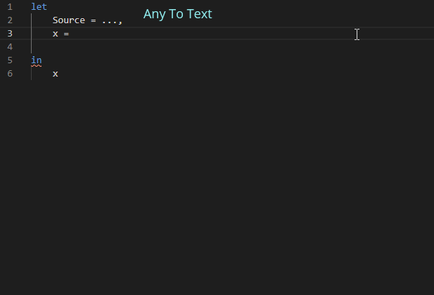

[](https://marketplace.visualstudio.com/items?itemName=PowerQuery.vscode-powerquery)
[](https://marketplace.visualstudio.com/items?itemName=PowerQuery.vscode-powerquery)

# Power Query language service for VS Code

Available in the
[Visual Studio Code Marketplace](https://marketplace.visualstudio.com/items?itemName=PowerQuery.vscode-powerquery).
Provides a language service for the
[Power Query / M formula language](https://powerquery.microsoft.com/) with the
following capabilities:

## Fuzzy autocomplete

Suggests keywords, local variables, and the standard Power Query library.



## Hover


## Function hints

Displays function documentation if it exists, and validates the types for
function arguments.


## Code formatting

Provides a formatter for the "Format Document" (Alt + Shift + F) command.


## Commands

### String encoding/decoding

These commands can be used to add/remove M and JSON string formatting to/from
the currently selected text. This can be helpful when you need to encode an
embedded SQL (or other) query in an M expression, or when you're working with
files that contain embedded M expressions, such as Power BI Dataflow's
[model.json](https://docs.microsoft.com/en-us/common-data-model/model-json)
file, and Power Query traces. There is a `powerquery.editor.transformTarget`
setting in the extension to choose the target for the operation. `inPlace` (the
default) replaces the currently selected text with the updated value.
`clipboard` does not change the currently selected text, and puts the
transformed text on the clipboard.

These commands require one or more text selections in the active editor window.


| Command                     | Label                                      |
| --------------------------- | ------------------------------------------ |
| powerquery.jsonEscapeText   | Encode selection as JSON string            |
| powerquery.jsonUnescapeText | Remove JSON string encoding from selection |
| powerquery.mEscapeText      | Encode selection as an M text value        |
| powerquery.mUnescapeText    | Remove M text encoding from selection      |

A more specialized version of this command will extract the M Document from an
entire model.json/dataflow.json document. This command requires the active
document to be recognized as JSON. The result is a new PowerQuery document.

| Command                            | Label                              |
| ---------------------------------- | ---------------------------------- |
| powerquery.extractDataflowDocument | Extract M document from model.json |

## Related projects

-   [powerquery-parser](https://github.com/microsoft/powerquery-parser): A
    lexer + parser for Power Query. Also contains features such as type
    validation.
-   [powerquery-formatter](https://github.com/microsoft/powerquery-formatter): A
    code formatter for Power Query which is bundled in the VSCode extension.
-   [powerquery-language-services](https://github.com/microsoft/powerquery-language-services):
    A high level library that wraps the parser for external projects, such as
    the VSCode extension. Includes features such as Intellisense.

## How to build

Install dependencies:

```cmd
npm install
```

Build the project:

```cmd
npm run build
```

Generate vsix package:

```cmd
npm run vsix
```

The .vsix can be installed into VS Code from the commandline:

```cmd
code --install-extension vscode-powerquery-*.vsix
```

## Testing

There are two test suites:

1. Server unit tests - `mocha` based, no build dependency.
2. Client UI test - `vscode/test-electron` based, requires webpacked test suite.

### Running tests from the command line

To run all tests:

```cmd
npm run webpack-prod
npm run test
```

To run server unit tests only:

```cmd
npm run test:server
```

### Running tests from VS Code

Run one of the following Debug/Launch profiles:

1. Run server unit tests
2. Language UI Test

> If you receive errors related to missing problem matchers, please ensure you
> have the
> [TypeScript + Webpack Problem Matchers](https://marketplace.visualstudio.com/items?itemName=amodio.tsl-problem-matcher)
> vscode extension installed.

## Contributing

This project welcomes contributions and suggestions. Most contributions require
you to agree to a Contributor License Agreement (CLA) declaring that you have
the right to, and actually do, grant us the rights to use your contribution. For
details, visit <https://cla.opensource.microsoft.com>.

When you submit a pull request, a CLA bot will automatically determine whether
you need to provide a CLA and decorate the PR appropriately (e.g., status check,
comment). Simply follow the instructions provided by the bot. You will only need
to do this once across all repos using our CLA.

This project has adopted the
[Microsoft Open Source Code of Conduct](https://opensource.microsoft.com/codeofconduct/).
For more information see the
[Code of Conduct FAQ](https://opensource.microsoft.com/codeofconduct/faq/) or
contact [opencode@microsoft.com](mailto:opencode@microsoft.com) with any
additional questions or comments.

## Trademarks

This project may contain trademarks or logos for projects, products, or
services. Authorized use of Microsoft trademarks or logos is subject to and must
follow
[Microsoft's Trademark & Brand Guidelines](https://www.microsoft.com/en-us/legal/intellectualproperty/trademarks/usage/general).
Use of Microsoft trademarks or logos in modified versions of this project must
not cause confusion or imply Microsoft sponsorship. Any use of third-party
trademarks or logos are subject to those third-party's policies.
